Mini Data-Analysis Deliverable 1
================
Ariel Rosen
October 12, 2022

# Welcome to your (maybe) first-ever data analysis project!

And hopefully the first of many. Let’s get started:

1.  Install the [`datateachr`](https://github.com/UBC-MDS/datateachr)
    package by typing the following into your **R terminal**:

<!-- -->

    install.packages("devtools")
    devtools::install_github("UBC-MDS/datateachr")

2.  Load the packages below.

``` r
library(datateachr)
library(tidyverse)
```

    ## ── Attaching packages ─────────────────────────────────────── tidyverse 1.3.2 ──
    ## ✔ ggplot2 3.3.6      ✔ purrr   0.3.4 
    ## ✔ tibble  3.1.8      ✔ dplyr   1.0.10
    ## ✔ tidyr   1.2.1      ✔ stringr 1.4.1 
    ## ✔ readr   2.1.3      ✔ forcats 0.5.2 
    ## ── Conflicts ────────────────────────────────────────── tidyverse_conflicts() ──
    ## ✖ dplyr::filter() masks stats::filter()
    ## ✖ dplyr::lag()    masks stats::lag()

3.  Make a repository in the <https://github.com/stat545ubc-2022>
    Organization. You will be working with this repository for the
    entire data analysis project. You can either make it public, or make
    it private and add the TA’s and Lucy as collaborators. A link to
    help you create a private repository is available on the
    \#collaborative-project Slack channel.

# Instructions

## For Both Milestones

-   Each milestone is worth 45 points. The number of points allocated to
    each task will be annotated within each deliverable. Tasks that are
    more challenging will often be allocated more points.

-   10 points will be allocated to the reproducibility, cleanliness, and
    coherence of the overall analysis. While the two milestones will be
    submitted as independent deliverables, the analysis itself is a
    continuum - think of it as two chapters to a story. Each chapter, or
    in this case, portion of your analysis, should be easily followed
    through by someone unfamiliar with the content.
    [Here](https://swcarpentry.github.io/r-novice-inflammation/06-best-practices-R/)
    is a good resource for what constitutes “good code”. Learning good
    coding practices early in your career will save you hassle later on!

## For Milestone 1

**To complete this milestone**, edit [this very `.Rmd`
file](https://raw.githubusercontent.com/UBC-STAT/stat545.stat.ubc.ca/master/content/mini-project/mini-project-1.Rmd)
directly. Fill in the sections that are tagged with
`<!--- start your work below --->`.

**To submit this milestone**, make sure to knit this `.Rmd` file to an
`.md` file by changing the YAML output settings from
`output: html_document` to `output: github_document`. Commit and push
all of your work to the mini-analysis GitHub repository you made
earlier, and tag a release on GitHub. Then, submit a link to your tagged
release on canvas.

**Points**: This milestone is worth 45 points: 43 for your analysis, 1
point for having your Milestone 1 document knit error-free, and 1 point
for tagging your release on Github.

# Learning Objectives

By the end of this milestone, you should:

-   Become familiar with your dataset of choosing
-   Select 4 questions that you would like to answer with your data
-   Generate a reproducible and clear report using R Markdown
-   Become familiar with manipulating and summarizing your data in
    tibbles using `dplyr`, with a research question in mind.

# Task 1: Choose your favorite dataset (10 points)

The `datateachr` package by Hayley Boyce and Jordan Bourak currently
composed of 7 semi-tidy datasets for educational purposes. Here is a
brief description of each dataset:

-   *apt_buildings*: Acquired courtesy of The City of Toronto’s Open
    Data Portal. It currently has 3455 rows and 37 columns.

-   *building_permits*: Acquired courtesy of The City of Vancouver’s
    Open Data Portal. It currently has 20680 rows and 14 columns.

-   *cancer_sample*: Acquired courtesy of UCI Machine Learning
    Repository. It currently has 569 rows and 32 columns.

-   *flow_sample*: Acquired courtesy of The Government of Canada’s
    Historical Hydrometric Database. It currently has 218 rows and 7
    columns.

-   *parking_meters*: Acquired courtesy of The City of Vancouver’s Open
    Data Portal. It currently has 10032 rows and 22 columns.

-   *steam_games*: Acquired courtesy of Kaggle. It currently has 40833
    rows and 21 columns.

-   *vancouver_trees*: Acquired courtesy of The City of Vancouver’s Open
    Data Portal. It currently has 146611 rows and 20 columns.

**Things to keep in mind**

-   We hope that this project will serve as practice for carrying our
    your own *independent* data analysis. Remember to comment your code,
    be explicit about what you are doing, and write notes in this
    markdown document when you feel that context is required. As you
    advance in the project, prompts and hints to do this will be
    diminished - it’ll be up to you!

-   Before choosing a dataset, you should always keep in mind **your
    goal**, or in other ways, *what you wish to achieve with this data*.
    This mini data-analysis project focuses on *data wrangling*,
    *tidying*, and *visualization*. In short, it’s a way for you to get
    your feet wet with exploring data on your own.

And that is exactly the first thing that you will do!

1.1 Out of the 7 datasets available in the `datateachr` package, choose
**4** that appeal to you based on their description. Write your choices
below:

**Note**: We encourage you to use the ones in the `datateachr` package,
but if you have a dataset that you’d really like to use, you can include
it here. But, please check with a member of the teaching team to see
whether the dataset is of appropriate complexity. Also, include a
**brief** description of the dataset here to help the teaching team
understand your data.

<!-------------------------- Start your work below ---------------------------->

1: *flow_sample*  
2: *cancer_sample*  
3: *building_permits*  
4: *vancouver_trees*

<!----------------------------------------------------------------------------->

1.2 One way to narrowing down your selection is to *explore* the
datasets. Use your knowledge of dplyr to find out at least *3*
attributes about each of these datasets (an attribute is something such
as number of rows, variables, class type…). The goal here is to have an
idea of *what the data looks like*.

*Hint:* This is one of those times when you should think about the
cleanliness of your analysis. I added a single code chunk for you below,
but do you want to use more than one? Would you like to write more
comments outside of the code chunk?

<!-------------------------- Start your work below ---------------------------->

``` r
#exploring a sample of each data set using head()
head(flow_sample)
```

    ## # A tibble: 6 × 7
    ##   station_id  year extreme_type month   day  flow sym  
    ##   <chr>      <dbl> <chr>        <dbl> <dbl> <dbl> <chr>
    ## 1 05BB001     1909 maximum          7     7   314 <NA> 
    ## 2 05BB001     1910 maximum          6    12   230 <NA> 
    ## 3 05BB001     1911 maximum          6    14   264 <NA> 
    ## 4 05BB001     1912 maximum          8    25   174 <NA> 
    ## 5 05BB001     1913 maximum          6    11   232 <NA> 
    ## 6 05BB001     1914 maximum          6    18   214 <NA>

``` r
head(cancer_sample)
```

    ## # A tibble: 6 × 32
    ##       ID diagn…¹ radiu…² textu…³ perim…⁴ area_…⁵ smoot…⁶ compa…⁷ conca…⁸ conca…⁹
    ##    <dbl> <chr>     <dbl>   <dbl>   <dbl>   <dbl>   <dbl>   <dbl>   <dbl>   <dbl>
    ## 1 8.42e5 M          18.0    10.4   123.    1001   0.118   0.278   0.300   0.147 
    ## 2 8.43e5 M          20.6    17.8   133.    1326   0.0847  0.0786  0.0869  0.0702
    ## 3 8.43e7 M          19.7    21.2   130     1203   0.110   0.160   0.197   0.128 
    ## 4 8.43e7 M          11.4    20.4    77.6    386.  0.142   0.284   0.241   0.105 
    ## 5 8.44e7 M          20.3    14.3   135.    1297   0.100   0.133   0.198   0.104 
    ## 6 8.44e5 M          12.4    15.7    82.6    477.  0.128   0.17    0.158   0.0809
    ## # … with 22 more variables: symmetry_mean <dbl>, fractal_dimension_mean <dbl>,
    ## #   radius_se <dbl>, texture_se <dbl>, perimeter_se <dbl>, area_se <dbl>,
    ## #   smoothness_se <dbl>, compactness_se <dbl>, concavity_se <dbl>,
    ## #   concave_points_se <dbl>, symmetry_se <dbl>, fractal_dimension_se <dbl>,
    ## #   radius_worst <dbl>, texture_worst <dbl>, perimeter_worst <dbl>,
    ## #   area_worst <dbl>, smoothness_worst <dbl>, compactness_worst <dbl>,
    ## #   concavity_worst <dbl>, concave_points_worst <dbl>, symmetry_worst <dbl>, …

``` r
head(vancouver_trees)
```

    ## # A tibble: 6 × 20
    ##   tree_id civic_number std_str…¹ genus…² speci…³ culti…⁴ commo…⁵ assig…⁶ root_…⁷
    ##     <dbl>        <dbl> <chr>     <chr>   <chr>   <chr>   <chr>   <chr>   <chr>  
    ## 1  149556          494 W 58TH AV ULMUS   AMERIC… BRANDON BRANDO… N       N      
    ## 2  149563          450 W 58TH AV ZELKOVA SERRATA <NA>    JAPANE… N       N      
    ## 3  149579         4994 WINDSOR … STYRAX  JAPONI… <NA>    JAPANE… N       N      
    ## 4  149590          858 E 39TH AV FRAXIN… AMERIC… AUTUMN… AUTUMN… Y       N      
    ## 5  149604         5032 WINDSOR … ACER    CAMPES… <NA>    HEDGE … N       N      
    ## 6  149616          585 W 61ST AV PYRUS   CALLER… CHANTI… CHANTI… N       N      
    ## # … with 11 more variables: plant_area <chr>, on_street_block <dbl>,
    ## #   on_street <chr>, neighbourhood_name <chr>, street_side_name <chr>,
    ## #   height_range_id <dbl>, diameter <dbl>, curb <chr>, date_planted <date>,
    ## #   longitude <dbl>, latitude <dbl>, and abbreviated variable names
    ## #   ¹​std_street, ²​genus_name, ³​species_name, ⁴​cultivar_name, ⁵​common_name,
    ## #   ⁶​assigned, ⁷​root_barrier

``` r
head(apt_buildings)
```

    ## # A tibble: 6 × 37
    ##      id air_co…¹ ameni…² balco…³ barri…⁴ bike_…⁵ exter…⁶ fire_…⁷ garba…⁸ heati…⁹
    ##   <dbl> <chr>    <chr>   <chr>   <chr>   <chr>   <chr>   <chr>   <chr>   <chr>  
    ## 1 10359 NONE     Outdoo… YES     YES     0 indo… NO      YES     YES     HOT WA…
    ## 2 10360 NONE     Outdoo… YES     NO      0 indo… NO      YES     YES     HOT WA…
    ## 3 10361 NONE     <NA>    YES     NO      Not Av… NO      YES     NO      HOT WA…
    ## 4 10362 NONE     <NA>    YES     YES     Not Av… YES     YES     NO      HOT WA…
    ## 5 10363 NONE     <NA>    NO      NO      12 ind… NO      YES     NO      HOT WA…
    ## 6 10364 NONE     <NA>    NO      NO      Not Av… <NA>    YES     NO      HOT WA…
    ## # … with 27 more variables: intercom <chr>, laundry_room <chr>,
    ## #   locker_or_storage_room <chr>, no_of_elevators <dbl>, parking_type <chr>,
    ## #   pets_allowed <chr>, prop_management_company_name <chr>,
    ## #   property_type <chr>, rsn <dbl>, separate_gas_meters <chr>,
    ## #   separate_hydro_meters <chr>, separate_water_meters <chr>,
    ## #   site_address <chr>, sprinkler_system <chr>, visitor_parking <chr>,
    ## #   ward <chr>, window_type <chr>, year_built <dbl>, year_registered <dbl>, …

<!----------------------------------------------------------------------------->

1.3 Now that you’ve explored the 4 datasets that you were initially most
interested in, let’s narrow it down to 2. What lead you to choose these
2? Briefly explain your choices below, and feel free to include any code
in your explanation.

<!-------------------------- Start your work below ---------------------------->

I have narrowed it down to vancouver_trees and apt_buildings because
these two data sets both have a mix of categorical and numerical
variables, which I think makes for interesting data to work.

<!----------------------------------------------------------------------------->

1.4 Time for the final decision! Going back to the beginning, it’s
important to have an *end goal* in mind. For example, if I had chosen
the `titanic` dataset for my project, I might’ve wanted to explore the
relationship between survival and other variables. Try to think of 1
research question that you would want to answer with each dataset. Note
them down below, and make your final choice based on what seems more
interesting to you!

<!-------------------------- Start your work below ---------------------------->

*apt_buildings*: what is the relationship between number of stories and
year built?

*vancouver_trees*: which tree species planted on Vancouver streets has
the largest diameter?

<!----------------------------------------------------------------------------->

# Important note

Read Tasks 2 and 3 *fully* before starting to complete either of them.
Probably also a good point to grab a coffee to get ready for the fun
part!

This project is semi-guided, but meant to be *independent*. For this
reason, you will complete tasks 2 and 3 below (under the **START HERE**
mark) as if you were writing your own exploratory data analysis report,
and this guidance never existed! Feel free to add a brief introduction
section to your project, format the document with markdown syntax as you
deem appropriate, and structure the analysis as you deem appropriate.
Remember, marks will be awarded for completion of the 4 tasks, but 10
points of the whole project are allocated to a reproducible and clean
analysis. If you feel lost, you can find a sample data analysis
[here](https://www.kaggle.com/headsortails/tidy-titarnic) to have a
better idea. However, bear in mind that it is **just an example** and
you will not be required to have that level of complexity in your
project.

# Task 2: Exploring your dataset (15 points)

If we rewind and go back to the learning objectives, you’ll see that by
the end of this deliverable, you should have formulated *4* research
questions about your data that you may want to answer during your
project. However, it may be handy to do some more exploration on your
dataset of choice before creating these questions - by looking at the
data, you may get more ideas. **Before you start this task, read all
instructions carefully until you reach START HERE under Task 3**.

2.1 Complete *4 out of the following 8 exercises* to dive deeper into
your data. All datasets are different and therefore, not all of these
tasks may make sense for your data - which is why you should only answer
*4*. Use *dplyr* and *ggplot*.

1.  Plot the distribution of a numeric variable.
2.  Create a new variable based on other variables in your data (only if
    it makes sense)
3.  Investigate how many missing values there are per variable. Can you
    find a way to plot this?
4.  Explore the relationship between 2 variables in a plot.
5.  Filter observations in your data according to your own criteria.
    Think of what you’d like to explore - again, if this was the
    `titanic` dataset, I may want to narrow my search down to passengers
    born in a particular year…
6.  Use a boxplot to look at the frequency of different observations
    within a single variable. You can do this for more than one variable
    if you wish!
7.  Make a new tibble with a subset of your data, with variables and
    observations that you are interested in exploring.
8.  Use a density plot to explore any of your variables (that are
    suitable for this type of plot).

2.2 For each of the 4 exercises that you complete, provide a *brief
explanation* of why you chose that exercise in relation to your data (in
other words, why does it make sense to do that?), and sufficient
comments for a reader to understand your reasoning and code.

<!-------------------------- Start your work below ---------------------------->

**1: Plot the distribution of a numeric variable.** I will plot the
distribution of number of storeys using a histogram. I made the outlines
black so it is easier to see the distribution.

``` r
exercise_1 <- ggplot(apt_buildings, aes(x = no_of_storeys))+ 
  geom_histogram(binwidth = 3, col=I("black"))
print(exercise_1)
```

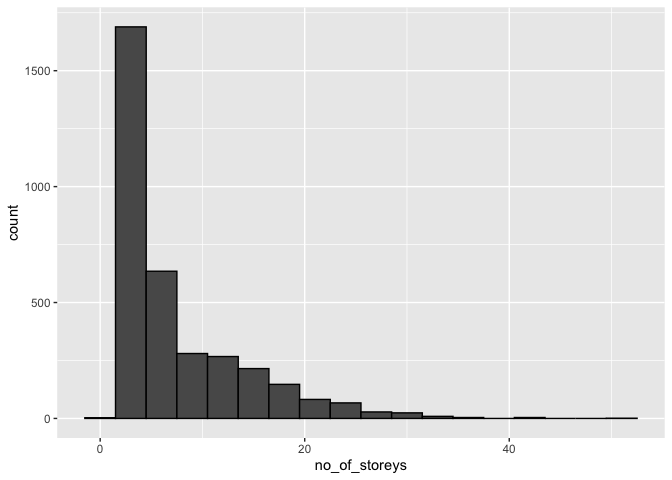<!-- -->

**2: Create a new variable based on other variables in your data (only
if it makes sense)**

I want to explore a new variable based on the number of elevators per
number of units, to investigate which buildings have enough elevators.

``` r
exercise_2 <- apt_buildings %>%
  mutate(elevators_per_unit = no_of_elevators/no_of_units)

head(exercise_2)
```

    ## # A tibble: 6 × 38
    ##      id air_co…¹ ameni…² balco…³ barri…⁴ bike_…⁵ exter…⁶ fire_…⁷ garba…⁸ heati…⁹
    ##   <dbl> <chr>    <chr>   <chr>   <chr>   <chr>   <chr>   <chr>   <chr>   <chr>  
    ## 1 10359 NONE     Outdoo… YES     YES     0 indo… NO      YES     YES     HOT WA…
    ## 2 10360 NONE     Outdoo… YES     NO      0 indo… NO      YES     YES     HOT WA…
    ## 3 10361 NONE     <NA>    YES     NO      Not Av… NO      YES     NO      HOT WA…
    ## 4 10362 NONE     <NA>    YES     YES     Not Av… YES     YES     NO      HOT WA…
    ## 5 10363 NONE     <NA>    NO      NO      12 ind… NO      YES     NO      HOT WA…
    ## 6 10364 NONE     <NA>    NO      NO      Not Av… <NA>    YES     NO      HOT WA…
    ## # … with 28 more variables: intercom <chr>, laundry_room <chr>,
    ## #   locker_or_storage_room <chr>, no_of_elevators <dbl>, parking_type <chr>,
    ## #   pets_allowed <chr>, prop_management_company_name <chr>,
    ## #   property_type <chr>, rsn <dbl>, separate_gas_meters <chr>,
    ## #   separate_hydro_meters <chr>, separate_water_meters <chr>,
    ## #   site_address <chr>, sprinkler_system <chr>, visitor_parking <chr>,
    ## #   ward <chr>, window_type <chr>, year_built <dbl>, year_registered <dbl>, …

**4: Explore the relationship between two variables in a plot:**

**How does the number of stories in each building vary with the year the
building as built?**

It makes sense to answer this question by plotting number of stories as
a function of year built to visualize the changes in the number of
stories over time. I decided to use a dot plot with an alpha of 0.02 to
be able to see the density distributions of the different number of
stories over time.

``` r
(exercise_4 <- apt_buildings %>%
               ggplot(aes(year_built, no_of_storeys, alpha= 0.02))+
               geom_point()+
               ggtitle("Number of stories over time")+
               ylab(label = "Number of stories"))
```

    ## Warning: Removed 13 rows containing missing values (geom_point).

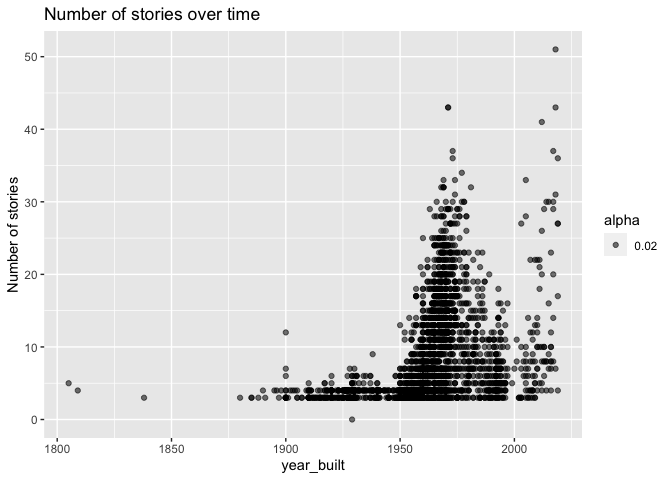<!-- -->

**6: Use a boxplot to look at the frequency of different observations
within a single variable. You can do this for more than one variable if
you wish!**

I want to investigate the distribution of number of stories each year. I
decided to split it into two groups, 1805-1950 and 1951 to 2019, to
avoid overcrowding the graph so it is easier to see.

``` r
#Separating the data into before 1950 and after 1950: 
yr_blt_before_1950 <- filter(apt_buildings, year_built <= 1950)
yr_blt_1950_today <- filter(apt_buildings, year_built > 1950)

#Using a boxplot to look at the number of storeys over the two groups of years
(exercise_6_before_1950 <- yr_blt_before_1950 %>% 
        ggplot(aes(group = year_built, x = year_built, y = no_of_storeys))+
        geom_boxplot (outlier.size = 0.2)+ 
        ggtitle("Frequency of number of stories from 1805 to 1950")+
        ylab("Number of stories"))
```

<!-- -->

``` r
(exercise_6_1950_today <- yr_blt_1950_today %>% 
        ggplot(aes(group = year_built, x = year_built, y = no_of_storeys))+
        geom_boxplot(outlier.size = 0.2)+ 
        ggtitle("Frequency of number of stories from 1951 to 2019")+
        ylab("Number of stories"))
```

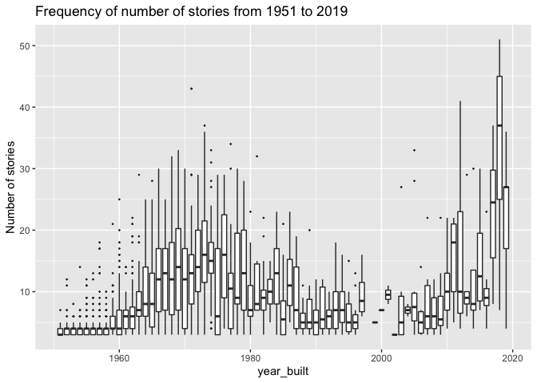<!-- -->

**7. Make a new tibble with a subset of your data, with variables and
observations that you are interested in exploring.**

I am interesting in exploring only buildings that have greater than 100
units.

``` r
exercise_7 <- filter(apt_buildings, no_of_units >100)
head(exercise_7)
```

    ## # A tibble: 6 × 37
    ##      id air_co…¹ ameni…² balco…³ barri…⁴ bike_…⁵ exter…⁶ fire_…⁷ garba…⁸ heati…⁹
    ##   <dbl> <chr>    <chr>   <chr>   <chr>   <chr>   <chr>   <chr>   <chr>   <chr>  
    ## 1 10359 NONE     Outdoo… YES     YES     0 indo… NO      YES     YES     HOT WA…
    ## 2 10360 NONE     Outdoo… YES     NO      0 indo… NO      YES     YES     HOT WA…
    ## 3 10366 CENTRAL… Indoor… YES     NO      Not Av… NO      YES     YES     HOT WA…
    ## 4 10367 NONE     <NA>    YES     YES     0 indo… NO      YES     YES     ELECTR…
    ## 5 10368 NONE     Indoor… YES     YES     Not Av… NO      YES     NO      HOT WA…
    ## 6 10370 NONE     <NA>    YES     NO      Not Av… NO      YES     YES     HOT WA…
    ## # … with 27 more variables: intercom <chr>, laundry_room <chr>,
    ## #   locker_or_storage_room <chr>, no_of_elevators <dbl>, parking_type <chr>,
    ## #   pets_allowed <chr>, prop_management_company_name <chr>,
    ## #   property_type <chr>, rsn <dbl>, separate_gas_meters <chr>,
    ## #   separate_hydro_meters <chr>, separate_water_meters <chr>,
    ## #   site_address <chr>, sprinkler_system <chr>, visitor_parking <chr>,
    ## #   ward <chr>, window_type <chr>, year_built <dbl>, year_registered <dbl>, …

<!----------------------------------------------------------------------------->

# Task 3: Write your research questions (5 points)

So far, you have chosen a dataset and gotten familiar with it through
exploring the data. Now it’s time to figure out 4 research questions
that you would like to answer with your data! Write the 4 questions and
any additional comments at the end of this deliverable. These questions
are not necessarily set in stone - TAs will review them and give you
feedback; therefore, you may choose to pursue them as they are for the
rest of the project, or make modifications!

**Research Questions**

1: How have the smoking rules changed in apartment buildings in Toronto
from 1805 until today?

2: Does the size of an apartment building in Toronto relate to the type
of property?

3: How has the way Toronto apartment buildings are heated changed from
1805 to today?

4: How has accessibility changed in apartment buildings in Toronto from
1805 to today?

<!--- *****START HERE***** --->

# Task 4: Process and summarize your data (13 points)

From Task 2, you should have an idea of the basic structure of your
dataset (e.g. number of rows and columns, class types, etc.). Here, we
will start investigating your data more in-depth using various data
manipulation functions.

### 1.1 (10 points)

Now, for each of your four research questions, choose one task from
options 1-4 (summarizing), and one other task from 4-8 (graphing). You
should have 2 tasks done for each research question (8 total). Make sure
it makes sense to do them! (e.g. don’t use a numerical variables for a
task that needs a categorical variable.). Comment on why each task helps
(or doesn’t!) answer the corresponding research question.

Ensure that the output of each operation is printed!

**Summarizing:**

1.  Compute the *range*, *mean*, and *two other summary statistics* of
    **one numerical variable** across the groups of **one categorical
    variable** from your data.
2.  Compute the number of observations for at least one of your
    categorical variables. Do not use the function `table()`!
3.  Create a categorical variable with 3 or more groups from an existing
    numerical variable. You can use this new variable in the other
    tasks! *An example: age in years into “child, teen, adult, senior”.*
4.  Based on two categorical variables, calculate two summary statistics
    of your choosing.

**Graphing:**

5.  Create a graph out of summarized variables that has at least two
    geom layers.
6.  Create a graph of your choosing, make one of the axes logarithmic,
    and format the axes labels so that they are “pretty” or easier to
    read.
7.  Make a graph where it makes sense to customize the alpha
    transparency.
8.  Create 3 histograms out of summarized variables, with each histogram
    having different sized bins. Pick the “best” one and explain why it
    is the best.

Make sure it’s clear what research question you are doing each operation
for!

<!------------------------- Start your work below ----------------------------->

**Research Question 1: How have the smoking rules changed in apartment
buildings in Toronto from 1805 until today?**

1.  *Summarizing*: \#2) Compute the number of observations for at least
    one of your categorical variables:

``` r
#First separate the data set into two separate data sets, one for non-smoking buildings and the other for smoking buildings 
nonsmoking <- filter(apt_buildings, `non-smoking_building` == "YES")%>%
              select(`id`,`non-smoking_building`)
smoking <- filter(apt_buildings, `non-smoking_building` == "NO")%>%
              select(`id`,`non-smoking_building`)
#Next, compute the dimensions of the data sets. The number of rows is the number of buildings in each category
dim(nonsmoking)
```

    ## [1] 1290    2

``` r
dim(smoking)
```

    ## [1] 2071    2

-   Based on the above observations, there are 1290 non-smoking
    buildings, and 2071 smoking buildings.
-   This task helps answer the research question because I get a sense
    of the general distribution of smoking vs. non-smoking buildings.
    However, it doesn’t help me understand how this distribution has
    changed over time.

2.  *Graphing*: \#5) Create a graph out of summarized variables that has
    at least two geom layers:

I want to visualize how the distribution of smoking vs. non-smoking
buildings has changed over time. I am limiting the plot to buildings
built after 1900 because there are very few buildings recorded prior to
1900, and including the buildings built prior to 1900 in the plot makes
it very small and difficult to see the distribution of smoking rules
from 1900 to today.

``` r
#First filtered the data set to only include buildings built after 1899
apt_buildings_after_1900 <- filter(apt_buildings, year_built > 1899)

#Then plot the distribution of smoking vs. non-smoking buildings over time 
(smoking_distribution <- apt_buildings_after_1900 %>%
    ggplot(mapping = aes(x = year_built, fill = `non-smoking_building`))+ 
    geom_bar(width =0.7)+
    ggtitle("Distribution of smoking rules over time"))
```

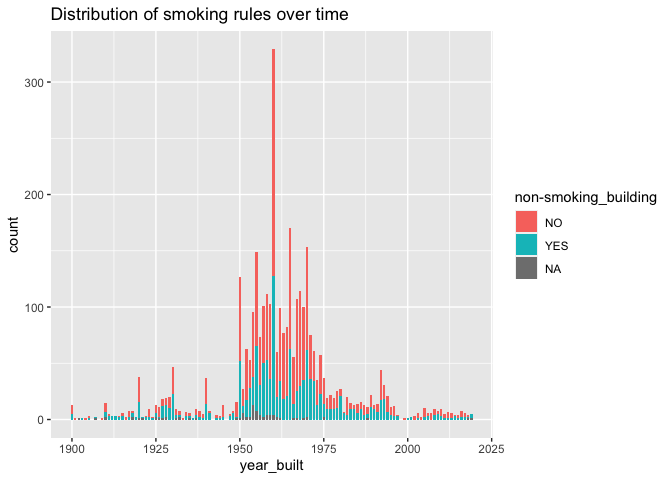<!-- -->

-   This task helps me answer the research question because I can
    visually see how the distribution of smoking vs. non-smoking
    buildings has changes over time.

**Research Question 2: Does the size of an apartment building in Toronto
relate to the type of property?**

1.  *Summarizing*: \#1) Compute the *range*, *mean*, and *two other
    summary statistics* of **one numerical variable** across the groups
    of **one categorical variable** from your data:

Computing the summary statistics of the number of units across the
groups of types of properties. Here, I am using number of units as a
proxy for the size of the apartment building.

``` r
#Pivot wider to make property type into columns with values from number of units 
property_type_and_no_units <- apt_buildings %>%
          pivot_wider(id_cols = id,
          names_from = property_type, 
          values_from = no_of_units) 

#Compute summary stats of property_type_no_units
summary(property_type_and_no_units)
```

    ##        id           PRIVATE             TCHC       SOCIAL HOUSING 
    ##  Min.   :10359   Min.   :   0.00   Min.   : 11.0   Min.   : 10.0  
    ##  1st Qu.:11222   1st Qu.:  23.00   1st Qu.: 50.0   1st Qu.: 29.0  
    ##  Median :12086   Median :  47.00   Median :128.0   Median : 68.0  
    ##  Mean   :12086   Mean   :  85.54   Mean   :146.2   Mean   : 82.9  
    ##  3rd Qu.:12950   3rd Qu.: 110.00   3rd Qu.:208.5   3rd Qu.:127.0  
    ##  Max.   :13813   Max.   :4111.00   Max.   :719.0   Max.   :297.0  
    ##                  NA's   :567       NA's   :3128    NA's   :3215

-   Based on the summary statistics:

    -   Range = 4111.00 (private); 708.0 (TCHC); 287.0 (social housing)

    -   Mean = 85.54 (private); 146.2 (TCHC); 82.9 (social housing)

    -   Median = 47.00 (private); 128.0 (TCHC); 68.0 (social housing)

    -   Max = 4111.00 (private); 719.0 (TCHC); 297.0 (social housing)

-   This task helps me answer the research question because based on the
    summary statistics, I can see if there are differences in the number
    of units based on the property type. However, these summary
    statistics do not tell me if the differences I’m observing are
    actually statistically significant.

2.  *Graphing*: \#5) Create 3 histograms out of summarized variables,
    with each histogram having different sized bins. Pick the “best” one
    and explain why it is the best:

``` r
#First create histograms with distributions of number of units for each of the property types, using the data set created above

(priv_number_of_units <- property_type_and_no_units %>%
  ggplot(aes(PRIVATE))+ geom_histogram(bins = 15)+ 
  ggtitle("Distribution of number of units across private properties"))
```

    ## Warning: Removed 567 rows containing non-finite values (stat_bin).

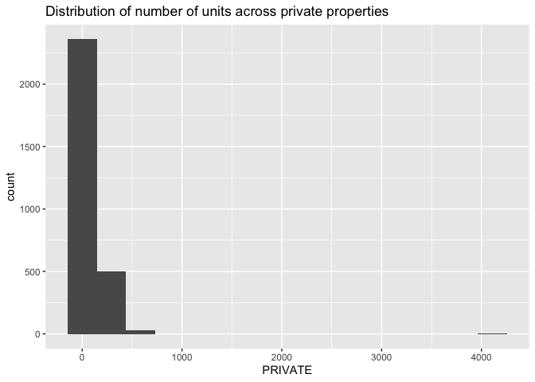<!-- -->

``` r
(TCHC_number_of_units_10_bins <- property_type_and_no_units %>%
  ggplot(aes(TCHC))+ geom_histogram(bins = 10)+ 
  ggtitle("Distribution of number of units across TCHC properties (10 bins)"))
```

    ## Warning: Removed 3128 rows containing non-finite values (stat_bin).

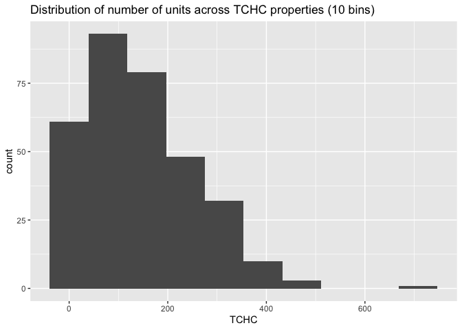<!-- -->

``` r
(social_number_of_units <- property_type_and_no_units %>%
  ggplot(aes(`SOCIAL HOUSING`))+ geom_histogram(bins = 10)+ 
  ggtitle("Distribution of number of units across social housing properties"))
```

    ## Warning: Removed 3215 rows containing non-finite values (stat_bin).

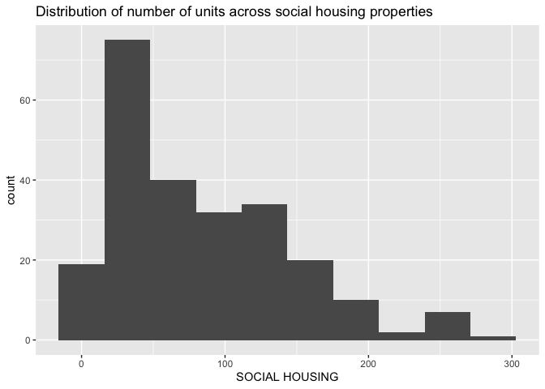<!-- -->

``` r
#To answer the prompt, created 2 more histograms from the TCHC data with different bin sizes to compare which is best
(TCHC_number_of_units_20_bins <- property_type_and_no_units %>%
  ggplot(aes(TCHC))+ geom_histogram(bins = 20)+ 
  ggtitle("Distribution of number of units across TCHC properties (20 bins)"))
```

    ## Warning: Removed 3128 rows containing non-finite values (stat_bin).

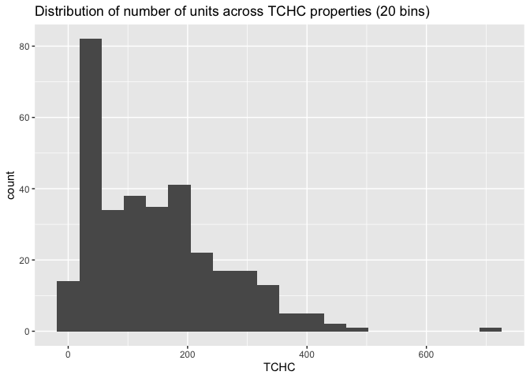<!-- -->

``` r
(TCHC_number_of_units_5_bins <- property_type_and_no_units %>%
  ggplot(aes(TCHC))+ geom_histogram(bins = 5)+ 
  ggtitle("Distribution of number of units across TCHC properties (5 bins)"))
```

    ## Warning: Removed 3128 rows containing non-finite values (stat_bin).

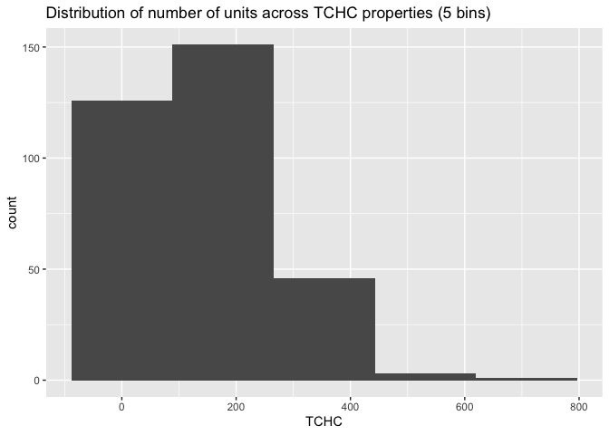<!-- -->

-   To align with the research question, I decided to create histograms
    for each property type. Then, to answer the prompt, I created 2
    additional histograms for the TCHC property type with various bin
    numbers to compare which looks best.

    -   As we can see above, the number of bins changes how the data is
        visualized. I think the 10 bins is the “best” representation of
        the data, because 5 bins is too smooth but 20 is not smooth
        enough . ALso, according to Sturge’s rule, bin sizes can be
        chosen according to bins = 1 +3.322 logn. For the TCHC data,
        this comes out to around 9.5 bins.

**Research Question 3: How has the way Toronto apartment buildings are
heated changed from 1805 to today?**

1.  *Summarizing:* \#3) Create a categorical variable with 3 or more
    groups from an existing numerical variable. You can use this new
    variable in the other tasks! I want to separate years into groups
    based on when different house heating methods were invented.Based on
    some brief research at
    <https://shiptons.ca/shiptons-blog/a-brief-history-of-home-heating/21>,
    I learned that:

    -   Before steam and electric heat, people mainly used stoves and
        fireplaces to heat their homes

    -   Electric heater was invented in 1883

    -   Central heating systems were invented in 1919

``` r
#First isolating only the year_built category from the entire data set
year_built_only <- select(apt_buildings, year_built)

#Dividing the years_built_only  into 3 categories based on stoves, electric, and central heat invention years
heat_categories <- within(year_built_only, 
{year_built.cat <- NA
 year_built.cat[year_built < 1883] <- "stove and fireplace"
 year_built.cat[year_built >= 1883 & year_built < 1919] <- "electric heater"
 year_built.cat[year_built >= 1919] <- "central heat"}) 
#Making a new data frame with only heat category and year built
apt_buildings_heat_categories <- merge(apt_buildings, heat_categories, by = "year_built")%>%
      select(id, year_built, year_built.cat, heating_type)

head(apt_buildings_heat_categories)
```

    ##      id year_built      year_built.cat heating_type
    ## 1 12064       1805 stove and fireplace    HOT WATER
    ## 2 10424       1809 stove and fireplace    HOT WATER
    ## 3 10906       1838 stove and fireplace     ELECTRIC
    ## 4 12869       1880 stove and fireplace    HOT WATER
    ## 5 10905       1885     electric heater     ELECTRIC
    ## 6 10905       1885     electric heater     ELECTRIC

-   This task is useful to answer the research question because it will
    be helpful to compare the actual type of heating system used in the
    building to the more popular heating sources of the era.

2.  *Graphing*: \#5) Create a graph out of summarized variables that has
    at least two geom layers:

I want to create a plot showing the distribution of different heating
sources over time.

``` r
(heating_over_time <- apt_buildings %>%
  ggplot(aes(x= year_built))+
  geom_density(aes(group = `heating_type`, color = `heating_type`)))
```

    ## Warning: Removed 13 rows containing non-finite values (stat_density).

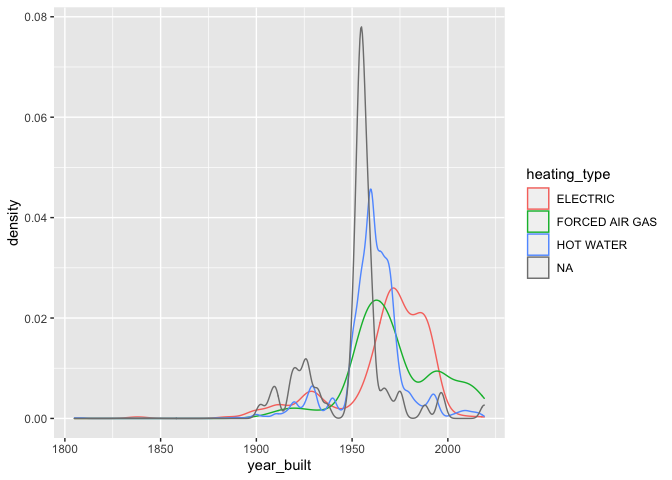<!-- -->

-   This task helps answer the research question because we can
    visualize the rise and fall in popularity of different types of
    heating from 1805 to 2019. It is also interesting to see that in the
    1950s the type of heating was quite often not reported.

**Research question 4: How has accessibility changed in apartment
buildings in Toronto from 1805 to today?**

1.  *Summarizing*: \#2) Compute the number of observations for at least
    one of your categorical variables. Do not use the function
    `table()`!

I want to compute the number of buildings that have a barrier free
accessibility entrance

``` r
#First separate the data set into two separate data sets, one for accessible entrances, and one for non-accessible entrances: 
barrier_free_entrance <- filter (apt_buildings, `barrier_free_accessibilty_entr` == "YES") %>%
            select(`id`,`barrier_free_accessibilty_entr`)

barrier_entrance <- filter (apt_buildings, `barrier_free_accessibilty_entr` == "NO") %>%
            select(`id`,`barrier_free_accessibilty_entr`)

#Next, compute the dimensions of the data sets. The number of rows is the number of buildings in each category
dim(barrier_free_entrance)
```

    ## [1] 1339    2

``` r
dim(barrier_entrance)
```

    ## [1] 2034    2

-   This tells us that 1339 buildings have a barrier free accessibility
    entrance, whereas 2049 buildings no not. This task is helpful in
    understanding the distribution of barrier free vs. barrier
    entrances, however it does not directly answer the research question
    because it does not tell us how the distribution of accessible
    entrances has changes over time.

2.  *Graphing*: \#7) Make a graph where it makes sense to customize the
    alpha transparency.

I want to visualize how the number of barrier free accessible units has
changed over time, and to see if buildings with more barrier free
accessible units also a barrier free accessible entrance.

``` r
accessibility_over_time <- apt_buildings %>%
                    ggplot(aes(x = year_built, y = no_barrier_free_accessible_units))+ 
                    geom_point(alpha = 0.5, aes(color = barrier_free_accessibilty_entr))+ 
                    ggtitle("Accessibility features over time")+
                    ylab("Number of barrier free accessible units")+
                    xlab("Year built")
print(accessibility_over_time)
```

    ## Warning: Removed 155 rows containing missing values (geom_point).

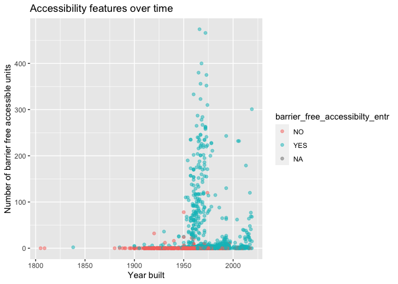<!-- -->

-   This tasks helps answer the research question because it allows us
    to visualize how the different accessibility features in buildings
    have changed over time. The colours allow us to see that more modern
    buildings tend to have an accessible entrance, compared to older
    buildings. Also, we can see that in the 1950s there seemed to be an
    increase in the number of accessible units in a building.

    <!----------------------------------------------------------------------------->

### 1.2 (3 points)

Based on the operations that you’ve completed, how much closer are you
to answering your research questions? Think about what aspects of your
research questions remain unclear. Can your research questions be
refined, now that you’ve investigated your data a bit more? Which
research questions are yielding interesting results?

<!-------------------------- Start your work below ---------------------------->

-   These exercises have helped me get closer to answering my research
    questions, however there is still more work to be done. To break it
    down by each question:

    1.  **How have the smoking rules changed in apartment buildings in
        Toronto from 1805 until today?**
        -   I was able to compare the number of smoking vs. non-smoking
            buildings and visualize this distribution. To become even
            more refined, I could explore the percentage of non-smoking
            buildings that are built per year, and see if this
            percentage increases over time. I could plot that data so
            that I could quantify and visualize how smoking rules have
            changed.
    2.  **Does the size of an apartment building in Toronto relate to
        the type of property?**
        -   Based on the summary statistics, the mean number of units in
            a TCHC property is greater than both private properties and
            social housing, and private is greater than social housing.
            To make the question more refined, I would have to do some
            statistical analysis to know if these differences in number
            of units actually relate to the type of property. Also, the
            question could be refined to be more specific about the
            number of units, instead of generalizing to the size of the
            building.
    3.  **How has the way Toronto apartment buildings are heated changed
        from 1805 to today?**
        -   It was interesting to compare the data from the invention
            years to the actual heating systems because most of them did
            not align! The plot produced in the graphing exercise really
            did a good job of answering the research question because it
            is easy to visualize the rise and fall in popularity of the
            different heating systems.
    4.  **How has accessibility changed in apartment buildings in
        Toronto from 1805 to today?**
        -   I think this research question yielded interesting results,
            especially from the plot. We can see that most buildings
            with a high number of barrier free units also have
            accessible parking. However, to refine this research
            question, it would be interesting to narrow it down to the
            percentage of accessible units over the total number of
            units, since based on the plot I produced, we don’t know if
            the buildings with the highest numbers of accessible units
            are just much larger buildings compared to the rest.
            Expressing this value as a percent of overall units would
            make the answer the question with more clarity.

<!----------------------------------------------------------------------------->

### Attribution

Thanks to Icíar Fernández Boyano for mostly putting this together, and
Vincenzo Coia for launching.
